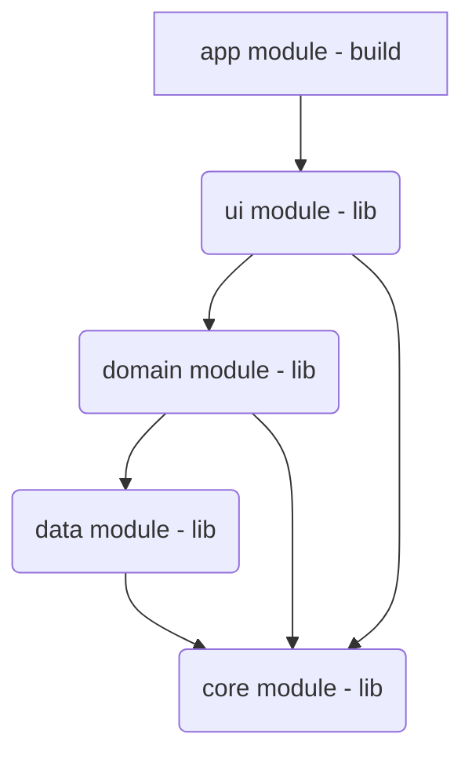

# Technical Test
## Subject

- Créer une textbox pour pouvoir saisir l'id d'une video (par exemple `x9d9k6k`) + un bouton "valider"

- Lors du clic sur le bouton "valider", il faudra request l'url suivante https://www.dailymotion.com/player/metadata/video/{id}

- il faudra ensuite afficher un player natif juste en dessous qui jouera la video en utilisant l'url dans `qualities.auto.url`

- il faudra ajouter les contrôles basiques de type play / pause

### Contraintes :

- projet en Kotlin, Gradle (buildscript)

- ne pas utiliser de librairies pour la requête réseau

- pour le player natif, il est possible d'utiliser Exoplayer

- un Readme clair pour donner des informations sur l'architecture de l'application, comment builder l'application et l'exécuter

- deadline de livraison : lundi 10 février 2025 soir

## Architecture

Modularized kotlin android application based on [Android Developers architecture guidelines](https://developer.android.com/topic/architecture?hl=fr)

### Dependency injection

Dependency injection performed with [Hilt](https://developer.android.com/training/dependency-injection/hilt-android?hl=fr)

### UI Design Pattern

Chosen UI design pattern is [MVVM](https://developer.android.com/topic/libraries/architecture/viewmodel?hl=fr) to fit last requirements from Android and recommended pattern.

### Gradle

[Kotlin DSL](https://docs.gradle.org/current/userguide/kotlin_dsl.html) + [Version Catalog .toml](https://docs.gradle.org/current/userguide/version_catalogs.html)

### Security

Obfuscation is performed by R8 and enabled for release build

### Network

To follow the subject constraint, no lib is used to perform API calls. I've created a tools class `HttpRequester` (`data` -> `network` -> `tools`) to allow developer perform HTTP call easily.
This `HttpRequester` is *scalable* and *generic* to support different types of data, http method and response (actually, I've only implemented for JSON response and GET method that were necessary for this subject)

## UI

I decided to do UI part with [Jetpack Compose](https://developer.android.com/jetpack/compose?hl=fr) because it offers powerful tools to implement beautiful UI with less and comprehensive code.

### Material3

Theme is designed with [Material3](https://m3.material.io) lib

### Media3 ExoPlayer

In order to display the video, I've chosen the [media3 exoplayer lib](https://developer.android.com/media/media3/exoplayer) supported by google

## User Guide

### Installation

1. Clone this Git repository in Android Studio
2. Run app build in debug or release
3. Test app

### Features

You can write the `id` of a dailymotion video and click on the button **Validate**. App will make a call to the dailymotion API to get the metadata video.
If an error occurred, the error will be displayed in a Text UI element, otherwise, the video player will be shown and will automatically play the video.

Application supports **landscape mode** and will display the video in fullscreen or a message if no video is currently displayed.